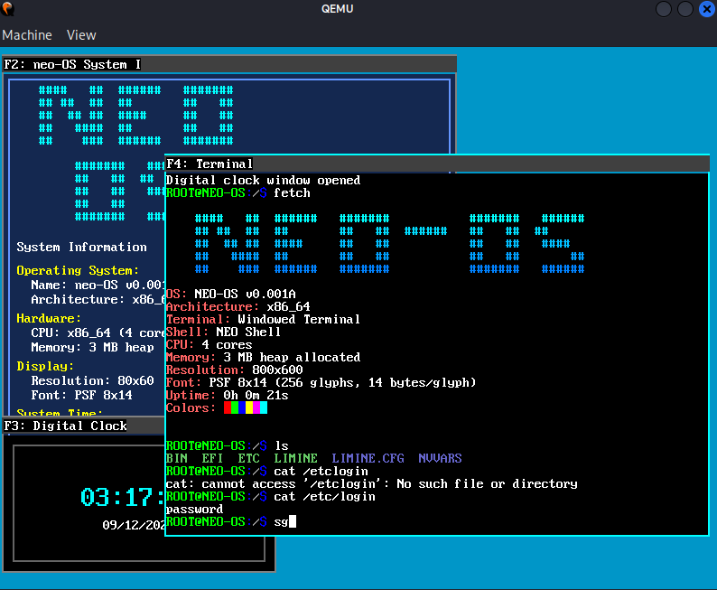

<div align="center">

# NEO-OS
**Built on LIMINE protocol with UEFI booting support**



[](https://github.com/2900xt/neo-OS) [](LICENSE) [](https://en.wikipedia.org/wiki/X86-64)

</div>

---

## Features

```
🧠 Memory Management       📁 File Systems           🖥️  User Interface
├─ Modular page allocator  ├─ Virtual file system    ├─ Window manager & GUI
├─ Heap management         ├─ FAT support            ├─ Custom shell & syntax
└─ Smart allocation        └─ Custom .nic icons      └─ VGA graphics driver

⚡ Performance             🔧 Hardware Support       ⏰ System Services  
├─ Multiprocessing (SMP)   ├─ APIC & ACPI drivers    ├─ Real-time clock
├─ Advanced scheduling     ├─ AHCI (hard disk)       ├─ Timer subsystem
└─ APIC timers             ├─ PCI bus scanning       └─ Power management
                           └─ Serial communication    
```

## Development Roadmap

```
Next Milestones:
├─ [ ] USB subsystem implementation
├─ [ ] Port BusyBox utilities  
└─ [ ] TCP/IP networking stack
```

## Quick Start

### Option 1: Use Prebuilt Binary
```bash
# Download and run the prebuilt image
make run-test
```

### Option 2: Build from Source

#### Prerequisites
```
Required packages:
├─ libmpfr, libgmp, libmpc
├─ texinfo, gcc, nasm
└─ qemu-system (for testing)
```

#### Build Instructions
```bash
# 1. Clone the repository
git clone https://github.com/2900xt/neo-OS.git
cd neo-OS

# 2. Build cross-compiler toolchain
./toolchain.sh

# 3. Compile and run
make run
```

---

## Development History

```
Timeline:
├─ T-DOS ────────────────── ❌ Failed (learning project)
├─ Open-OS ──────────────── ❌ Failed (redesign needed)
└─ NEO-OS ───────────────── ✅ Active development
```
Legacy Projects:
[T-DOS](https://github.com/2900xt/T-dos)
[Open-OS](https://github.com/2900xt/open-OS)


---

<div align="center">

**Made with ❤️ for the open source community and my own learning**

</div>
